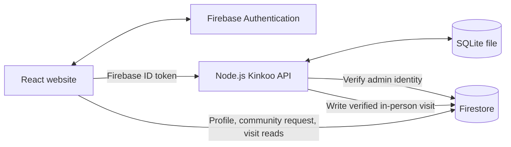

# Pause Café Website — Project Documentation

## Project overview

Pause is a React single-page website for a café. It provides public café pages, customer accounts, the Kinkoo loyalty program, reward vouchers, experience bookings, community membership, and an admin dashboard.

The system has two persistence layers with separate responsibilities:

- **Firebase Authentication and Firestore** retain customer profiles, admin authorization records, community membership requests, and verified in-person visit records.
- **A Node.js API and SQLite** store Kinkoo accounts, transactions, visit codes, monthly limits, reward vouchers, experience bookings, and the authoritative reward/experience catalogue.
- Browser `localStorage` still supports non-loyalty content and caches. Kinkoo balances and vouchers are not read from or written to browser storage.

## Architecture

| Layer | Implementation | Responsibility |
| --- | --- | --- |
| Web client | React 18, TypeScript, Vite, React Router | Customer and admin interface |
| Sign-in | Firebase Authentication | Customer/admin identity and Firebase ID tokens |
| Firebase database | Cloud Firestore | `users`, `admins`, `visits`, `community_members` |
| Kinkoo API | Node.js HTTP server | Authenticated customer and admin endpoints |
| Kinkoo database | SQLite (`node:sqlite`) | Transactional loyalty state on persistent server disk |



The client defaults to a same-origin API. During `npm run dev`, Vite mounts the SQLite API middleware. In production, `server/index.js` serves both the compiled website and API. The SQLite database defaults to `data/kinkoo.sqlite`; set `KINKOO_SQLITE_PATH` to choose another path.

**Hosting requirement:** production must run the Node server on a host with Node.js 22.18 or later and persistent disk storage. A static-only host such as Netlify cannot run the SQLite API or preserve the database file across restarts. If the website remains on Netlify, deploy this Node API as a separate persistent service, set the Netlify build variable `VITE_KINKOO_API_BASE_URL` to that service's origin, and set the API service variable `KINKOO_ALLOWED_ORIGINS` to the website origin (comma-separated if multiple origins are used). The API service also needs `FIREBASE_PROJECT_ID` and a persistent `KINKOO_SQLITE_PATH`.

## Important files

- `src/main.tsx` — React bootstrap and providers.
- `src/App.tsx` — customer and admin routes.
- `src/context/AuthContext.tsx` — Firebase sign-in state and admin role state.
- `src/context/AppContext.tsx` — shared customer data and UI actions.
- `src/firebase/config.ts` — Firebase app, Authentication, and Firestore initialization. It no longer initializes Firebase Functions.
- `src/services/localKinkooApi.ts` — sends Firebase ID tokens to the local Node API.
- `src/services/visitTokenService.ts` — typed client calls for Kinkoo, token, redemption, and experience APIs.
- `src/services/dataService.ts` — non-loyalty content and browser cache services; community membership requests are saved in Firestore.
- `src/services/accountDataService.ts` — reads user profile and verified visits from Firestore and loyalty history from SQLite.
- `server/index.js` — production HTTP server and built-site hosting.
- `server/kinkooApi.js` — API routes, Firebase token verification, admin checks, and loyalty transactions.
- `server/sqliteStore.js` — SQLite schema, indexes, and initial local catalogue data.
- `firestore.rules` — allows only the four Firebase collections described below.
- `firebase.json` — Firestore rules/index configuration; Firebase Functions are no longer configured for deployment.

## Routes and core features

### Customer website

| Route | Feature |
| --- | --- |
| `/` | Café home page and coffee interaction |
| `/menu` | Menu catalogue and item details |
| `/experience` | Experience slots and booking form |
| `/community` | Community content and membership form |
| `/story` | Brand story |
| `/offers` | Café offers |
| `/kinkoos` | Balance, visit code, weekly gift, reward catalogue, vouchers, transaction history |
| `/signin` | Customer sign-in and registration |
| `/account` | Account profile, activity, visits, and rewards |
| `/contact` | Café contact information |
| `/admin-controls/login` | Admin sign-in |
| `/admin-controls` | Admin dashboard, visit validation, voucher validation, and content tools |

### Loyalty rules and flows

- **Visit code:** a signed-in customer receives a random six-digit code. SQLite stores its SHA-256 hash, owner, status, and five-minute expiry. The code itself is returned once to the customer.
- **Visit validation:** an authenticated admin inspects and validates the code through the Node API. SQLite records the visit and awards 100 Kinkoos for each of the first six verified visits in that calendar month. Further visits are recorded without another visit award. The server also creates the verified visit record in Firestore `visits` using the admin's Firebase ID token.
- **Weekly gift:** the server grants 100 Kinkoos once per ISO week. A SQLite transaction and unique ledger reference prevent duplicate claims.
- **Reward redemption:** SQLite validates the reward, availability, stock, minimum 500-point balance, sufficient balance, and active-voucher rule. It deducts the points, updates stock, and issues an expiring voucher atomically.
- **Voucher validation:** an authenticated admin validates and consumes a voucher through SQLite. A consumed or expired voucher cannot be used again.
- **Experience booking:** slot capacity, booking record, monthly free-experience eligibility, and any Kinkoo deduction are handled by a SQLite transaction.

Weekly and monthly boundaries use the café's `Asia/Kolkata` timezone. Standard vouchers expire after ten days.

## Firebase collections

Firestore security rules permit the four active app collections below. Three legacy Kinkoo collections remain read-only solely so a customer's prior balance/history can be copied into SQLite the first time they use the new API. No new Kinkoo data is written to those legacy collections.

| Collection | Document key | Purpose | Access model |
| --- | --- | --- | --- |
| `users` | Firebase Auth UID | Customer profile: UID, name, email, photo, provider, phone, role, active status, and timestamps | Existing customer-owned profile rules retained; admins can read profiles |
| `admins` | Firebase Auth UID | Staff role and active status, including optional display name | A user can read their own admin record; website clients cannot change admin records |
| `visits` | `visit_{sha256}` | Verified in-person visit record: user, timestamp, points awarded, verifier, and notes | Owner/admin reads; only an authorized admin may create a verified record; update/delete denied |
| `community_members` | Generated request ID | Short community sign-up form with user ID, contact details, source, status, and timestamps | Signed-in users create their own request; admins read and manage requests |

Legacy `ledger`, `redemptions`, and `kinkooAccounts` documents are owner/admin-readable and client-write-denied for the transition import. New transactions and vouchers are SQLite-only.

Visit codes that have not yet been validated do not go into Firestore. Temporary code state and all Kinkoo data live in SQLite. Firebase Functions are not called by the client and are removed from the Firebase deployment configuration.

## SQLite database structure

The database schema is created automatically by `server/sqliteStore.js`.

| Table | Purpose | Important fields |
| --- | --- | --- |
| `accounts` | Current balance and lifetime totals per Firebase user ID | `user_id`, `balance`, `lifetime_earned`, `lifetime_spent`, timestamps |
| `ledger` | Immutable point credits/debits | `id`, `user_id`, signed `amount`, `type`, `description`, `reference_id`, timestamp, creator |
| `visit_tokens` | Hashed temporary codes and validated visit state | `token_hash`, user, status, expiry, verifier, visit award, notes |
| `monthly_visits` | Monthly verified/awarded visit counters | `user_id`, `month_key`, `verified_visits`, `awarded_visits` |
| `rewards` | Authoritative reward catalogue and stock | `id`, title, Kinkoo cost, availability, stock, JSON payload |
| `redemptions` | Voucher claims and validation status | unique code, reward, user, cost, status, expiry, consumption data |
| `experience_slots` | Capacity and local cache of bookable experience details | `id`, capacity, booked count, status, JSON payload |
| `experience_bookings` | Reservation, monthly reward use, and point spend | slot/user details, points spent, free-reward flag, status, timestamp |
| `firebase_visit_outbox` | Retry state for the Firebase copy of a verified visit | token hash, created time, sync time |
| `legacy_imports` | One-time loyalty-data import marker per user | `user_id`, `imported_at` |

SQLite uses WAL mode, foreign-key checks, a busy timeout, prepared statements, and `BEGIN IMMEDIATE` transactions for balance-changing flows. The balance, ledger, voucher, and stock update are committed together.

## API endpoints

All endpoints except `/api/kinkoo/health` require `Authorization: Bearer <Firebase ID token>`. Admin endpoints additionally verify `admins/{uid}` in Firestore.

| Method and path | Access | Purpose |
| --- | --- | --- |
| `GET /api/kinkoo/health` | Public | API health check |
| `GET /api/kinkoo/me` | Signed-in user | Own balance, ledger, visits, and vouchers |
| `GET /api/kinkoo/catalog` | Signed-in user | Active SQLite reward catalogue |
| `POST /api/kinkoo/visit-token` | Signed-in user | Generate a visit code |
| `POST /api/kinkoo/weekly-claim` | Signed-in user | Claim the weekly gift |
| `POST /api/kinkoo/redeem` | Signed-in user | Redeem a reward and issue a voucher |
| `POST /api/kinkoo/experience/book` | Signed-in user | Book an experience, optionally using monthly eligibility |
| `POST /api/kinkoo/visit/inspect` | Admin | Check a visit code |
| `POST /api/kinkoo/visit/verify` | Admin | Verify a visit, apply points, and write its Firebase visit record |
| `POST /api/kinkoo/visit/flag` | Admin | Flag an active visit code |
| `POST /api/kinkoo/reward/consume` | Admin | Validate and consume a reward voucher |
| `POST /api/kinkoo/catalog/sync` | Admin | Sync admin-edited rewards and experience slots into SQLite |
| `GET /api/kinkoo/redemptions` | Admin | List vouchers |
| `GET /api/kinkoo/admin/visits` | Admin | List locally recorded verified visits |
| `GET /api/kinkoo/admin/summary` | Admin | Get total points in circulation |
| `POST /api/kinkoo/admin/purge` | Admin | Clear local loyalty records and reset slot counts |

## Setup and commands

Firebase environment values are loaded by Vite for the browser and by `server/index.js` for local development. Production should provide `VITE_FIREBASE_*` values for the client, `FIREBASE_PROJECT_ID` for the server, and a persistent `KINKOO_SQLITE_PATH` if the default data directory is not persistent.

```bash
npm install
npm run dev
npm run build
npm start
```

`npm run dev` starts Vite with the API middleware mounted in the same process. For production, build the front end and run `npm start`; the Node server serves the build and handles API calls.

Firestore rules can be deployed independently of Cloud Functions:

```bash
firebase deploy --only firestore:rules
```

The legacy `functions/` source directory remains in the repository for reference, but the browser no longer calls it and `firebase.json` no longer configures it for deployment.

## Data transition note

When a customer first calls the SQLite API, the server copies their old ledger entries, verified visits, reward vouchers, and account balance from the legacy Firestore collections into SQLite. It records a per-user import marker so later calls use SQLite only. New loyalty data is not mirrored back to those legacy collections. The verified visit record is still written to the active Firebase `visits` collection by design.
